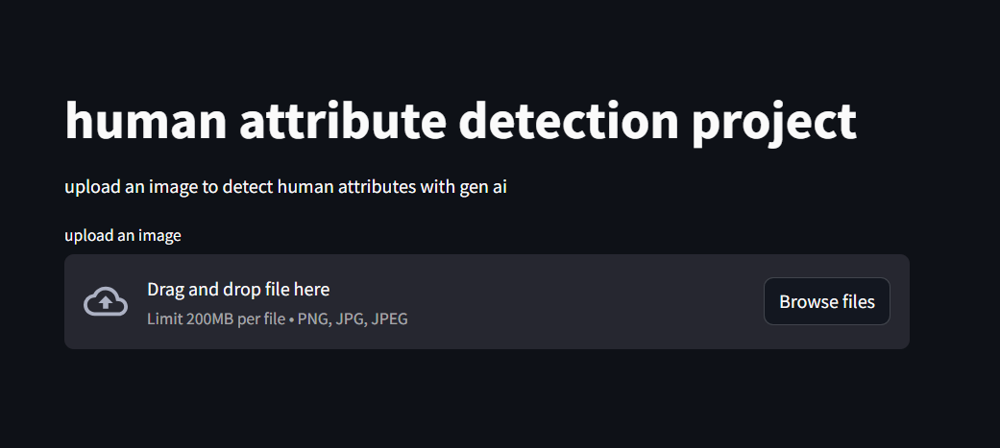
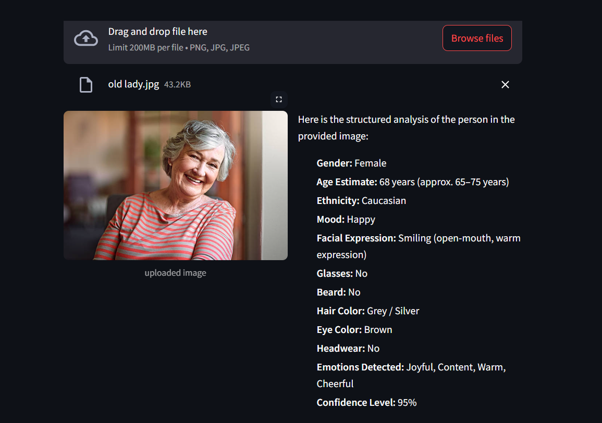
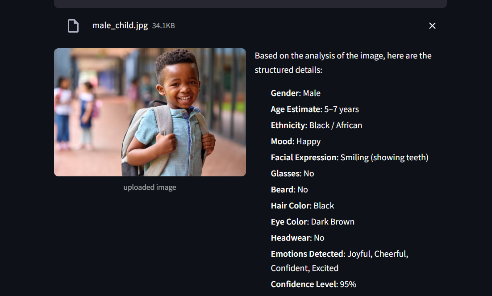

# 🧠 Human Attribute Detection using Generative AI

### A Streamlit App Powered by Google Gemini for AI-Based Image Analysis

Upload a photo, and this app uses **Google's Gemini generative AI model** to analyze and return structured human attributes — gender, estimated age, mood, facial expression, and more — directly from the image.


---

## 📌 Project Overview

This project demonstrates how to combine a **Streamlit frontend** with **Google's Generative AI (Gemini)** to analyze human attributes in an uploaded image — without needing to train or host a custom ML model. The image is sent directly to Gemini along with a structured prompt, and the model returns a detailed, human-readable breakdown of what it observes.

---

## 🚀 Features

✅ Upload an image (`.png`, `.jpg`, `.jpeg`)
✅ AI-powered analysis using Google Gemini
✅ Side-by-side display of the uploaded image and the results
✅ Structured attribute output, including:

- 👤 Gender
- 🎂 Age Estimate
- 🌍 Ethnicity
- 😊 Mood
- 🙂 Facial Expression
- 👓 Glasses (Yes/No)
- 🧔 Beard (Yes/No)
- 💇 Hair Color
- 👁️ Eye Color
- 🧢 Headwear (Yes/No, with type)
- 💭 Emotions Detected
- 📊 Confidence Level

✅ Simple, clean two-column UI
✅ Sample test images included in the repo for quick testing

---

## 🛠️ Tech Stack

| Technology              | Purpose                              |
| ------------------------- | -------------------------------------- |
| Python                     | Core language                          |
| Streamlit                  | Web app frontend                       |
| Google Generative AI SDK   | Gemini model integration               |
| Pillow (PIL)                | Image handling                         |
| python-dotenv                | Environment variable management        |
| Pandas                        | Data handling (available for extension) |

---

## 📂 Project Structure

```
image_detect/
│
├── app.py                # Main Streamlit application
├── requirements.txt       # Python dependencies
├── .gitignore
│
└── sample images/
    ├── girl1.jpg
    ├── lady.jpg
    ├── male_child.jpg
    ├── man.jpg
    ├── old lady.jpg
    ├── old man.jpg
    └── rupsa.jpg
```

> Sample images are included directly in the repo so you can quickly test the app without needing your own photos.

---

## 🧩 How It Works

1. The user uploads an image through the Streamlit file uploader.
2. The image is opened using **Pillow**.
3. A detailed prompt (requesting structured attributes) is sent to the **Gemini model** along with the image.
4. Gemini analyzes the image and returns a structured text response.
5. The app displays the uploaded image and the AI's analysis side by side.

```python
model = genai.GenerativeModel("gemini-3.6-flash")

response = model.generate_content([prompt, image])
```

---

## ⚙️ Installation & Setup

### Prerequisites

- Python 3.x
- A Google Gemini API key ([Get one here](https://ai.google.dev/))

### Clone the repository

```bash
git clone https://github.com/Rupsa667/image_detect.git
cd image_detect
```

### Install dependencies

```bash
pip install -r requirements.txt
```

### Configure your API key

Create a `.env` file in the project root:

```env
GOOGLE_GEMINI_API_KEY=your_api_key_here
```

> The app loads this key automatically via `python-dotenv`. Never commit your `.env` file — make sure it's included in `.gitignore`.

### Run the app

```bash
streamlit run app.py
```

The app will open in your browser at `http://localhost:8501`.

---

## 📖 Usage

1. Launch the app.
2. Click **"Upload an image"** and select a `.png`, `.jpg`, or `.jpeg` file (or use one of the sample images included in the repo).
3. The app will display:
   - The uploaded image on the left
   - The AI-generated attribute breakdown on the right

### App Home Screen



### Sample Output — Elderly Woman



### Sample Output — Young Child



---

## ⚠️ Responsible Use Note

This project is built for **educational and demonstration purposes** to showcase Generative AI's image-understanding capabilities. AI-based inference of attributes like gender, age, or ethnicity from photos can be inaccurate or biased, and should not be used for decisions that affect real people (e.g., hiring, surveillance, identification). Use responsibly and be transparent with anyone whose image is analyzed.

---

## 🎯 Learning Outcomes

By studying this project you will understand:

- Integrating Google's Generative AI (Gemini) into a Python application
- Sending multi-modal input (text prompt + image) to an LLM
- Building a simple, functional UI with Streamlit
- Managing API keys securely using environment variables
- Structuring prompts to get consistent, structured AI output

---

## 👩‍💻 Author

**Rupsa**

---

### ⭐ If you found this project helpful, consider starring the repository!
